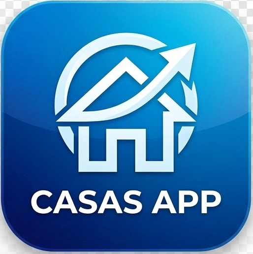

# Documentación: Casas App

<div align="center">
  
</div>

## 1. Esquema de Navegación

La aplicación utiliza el sistema de navegación de Jetpack Compose (`androidx.navigation.compose`) para gestionar el flujo entre pantallas de forma declarativa. Todo el sistema está controlado por un `NavHost` y un `NavController`.

### **Flujo Principal**
1. **`PantallaInicio` ("inicio")**: 
   - Es la pantalla inicial (Landing).
   - Contiene un botón que ejecuta `navController.navigate("galeria")`, llevando al usuario al catálogo principal.

2. **`PantallaGaleria` ("galeria")**:
   - Muestra el listado completo de las viviendas.
   - Cuenta con un `FloatingActionButton` (+) que navega hacia la creación con `navController.navigate("formulario")`.
   - Cada tarjeta de vivienda (CasaCard) tiene un modificador `clickable` que lleva a la pantalla de detalle pasando el ID de la casa elegida en la ruta: `navController.navigate("detalle/${casa.id}")`.

3. **`PantallaFormulario` ("formulario")**:
   - Permite crear una nueva vivienda.
   - Una vez los datos se han guardado con éxito en el ViewModel, el controlador retrocede en el historial usando `navController.popBackStack()`, devolviendo al usuario a la vista actualizada de la Galería.
   - También cuenta con una flecha "Volver" en la barra superior que acciona `navController.popBackStack()`.

4. **`PantallaDetalle` ("detalle/{id}")**:
   - Para recibir el parámetro dinámico `id`, la ruta en el `NavHost` se define como `detalle/{id}` y especifica en sus argumentos que espera un tipo entero (`IntType`).
   - El ID se recupera desde el `NavBackStackEntry`, y se solicita al ViewModel la información específica de la vivienda.
   - Al pulsar Eliminar o la flecha Volver, invoca `navController.popBackStack()` para volver a la galería.

---

## 2. Persistencia de Datos (Room + MVVM)

El acceso a los datos de la aplicación se orquesta implementando el patrón oficial **MVVM** (Model-View-ViewModel) recomendado por Google, separando claramente las responsabilidades con **Room** como capa de persistencia (SQLite local).

### **Flujo de Datos y Capas**

1. **La Entidad (`Casa.kt`)**: Representa la estructura ("Modelo") de una fila en la base de datos de Room. Define los atributos fundamentales: ID auto-generable, nombre, descripción e imagen.

2. **El DAO (`CasaDAO.kt`)**: El Data Access Object actúa como contrato con comandos SQL encapsulados. En él se encuentran métodos reactivos (`Flow`) y operaciones asíncronas (`suspend fun`).
   - `getAll()`: Emite automáticamente cualquier cambio que haya en la tabla, de este modo la interfaz se actualiza sola al añadir o eliminar un registro.

3. **El Repositorio (`RepositorioCasas.kt`)**: 
   - Funciona como la **Single Source of Truth** (Única Fuente de Verdad).
   - Recibe la instancia del `CasaDAO` mediante inyección en el constructor.
   - Abstrae los orígenes de datos (base de datos, posiblemente una API remota en un futuro) y sirve la información limpia hacia el ViewModel, asegurándose que el ViewModel nunca hable directamente con el origen de los datos.

4. **El ViewModel (`CasasViewModel.kt`)**:
   - Se inyecta el `RepositorioCasas` mediante el `ViewModelFactory`.
   - Lanza operaciones asíncronas al repositorio en hilos de background utilizando `viewModelScope.launch`.
   - Transforma directamente los `Flow` que vienen del Repositorio en `StateFlow` (vía `stateIn`), de manera que la Interfaz de Usuario pueda observarlos. Mantiene un almacenamiento caché reactivo tolerante a cambios de configuración como rotaciones de pantalla.

5. **La Interfaz de Usuario (UI - Compose)**:
   - Las pantallas no conocen detalles de la persistencia de datos ni de bases de datos de SQLite.
   - Observan pasivamente el estado del ViewModel utilizando `.collectAsState()`, renderizándose automáticamente ante un cambio en Room.
   - Propagan eventos de usuario (como el clic a un botón "Guardar") directamente llamando a funciones del ViewModel y la navegación.

---

## 3. Código Modificado

### `RepositorioCasas.kt`
```kotlin
package com.example.casasapp.data

import kotlinx.coroutines.flow.Flow

class RepositorioCasas(private val casaDao: CasaDAO) {

    // pillamos todas de golpe
    fun getAllCasas(): Flow<List<Casa>> {
        return casaDao.getAll()
    }

    // pillamos una sola pasando el id
    fun getCasaById(id: Int): Flow<Casa?> {
        return casaDao.getById(id)
    }

    // metemos una nueva
    suspend fun insertCasa(casa: Casa) {
        casaDao.insert(casa)
    }

    // borramos una casa
    suspend fun deleteCasa(casa: Casa) {
        casaDao.delete(casa)
    }

    // por si editamos en el futuro
    suspend fun updateCasa(casa: Casa) {
        casaDao.update(casa)
    }
}
```

### `CasasViewModel.kt`
```kotlin
package com.example.casasapp.ui.viewmodel

import androidx.lifecycle.ViewModel
import androidx.lifecycle.viewModelScope
import com.example.casasapp.data.Casa
import com.example.casasapp.data.RepositorioCasas
import kotlinx.coroutines.flow.SharingStarted
import kotlinx.coroutines.flow.StateFlow
import kotlinx.coroutines.flow.stateIn
import kotlinx.coroutines.launch

// puente entre la vista y el Repositorio siguiendo MVVM estricto
class CasasViewModel(private val repositorio: RepositorioCasas) : ViewModel() {

    // pillamos todas las casas a través del repo
    val casas: StateFlow<List<Casa>> = repositorio.getAllCasas().stateIn(
        scope = viewModelScope,
        started = SharingStarted.WhileSubscribed(5000),
        initialValue = emptyList()
    )

    // metemos una nueva a través del repo
    fun addCasa(casa: Casa) {
        viewModelScope.launch {
            repositorio.insertCasa(casa)
        }
    }

    // borramos a través del repo
    fun deleteCasa(casa: Casa) {
        viewModelScope.launch {
            repositorio.deleteCasa(casa)
        }
    }

    // buscamos por id a través del repo
    fun getCasaById(id: Int): StateFlow<Casa?> {
        return repositorio.getCasaById(id).stateIn(
            scope = viewModelScope,
            started = SharingStarted.WhileSubscribed(5000),
            initialValue = null
        )
    }
}
```

### `ViewModelFactory.kt`
```kotlin
package com.example.casasapp.ui.viewmodel

import androidx.lifecycle.ViewModel
import androidx.lifecycle.ViewModelProvider
import com.example.casasapp.data.RepositorioCasas

class ViewModelFactory(private val repositorio: RepositorioCasas) : ViewModelProvider.Factory {
    override fun <T : ViewModel> create(modelClass: Class<T>): T {
        if (modelClass.isAssignableFrom(CasasViewModel::class.java)) {
            @Suppress("UNCHECKED_CAST")
            return CasasViewModel(repositorio) as T
        }
        throw IllegalArgumentException("Unknown ViewModel class")
    }
}
```

### `MainActivity.kt` (Fragmento modificado)
```kotlin
    override fun onCreate(savedInstanceState: Bundle?) {
        super.onCreate(savedInstanceState)
        setContent {
            // instanciamos la bbdd, el repo y el viewmodel para pasarle los datos a las pantallas
            val database = AppDatabase.getDatabase(this)
            val repositorio = RepositorioCasas(database.casaDao())
            val viewModel: CasasViewModel = viewModel(factory = ViewModelFactory(repositorio))
            CasasAppTheme {
                AppNavigation(viewModel)
            }
        }
    }
```
